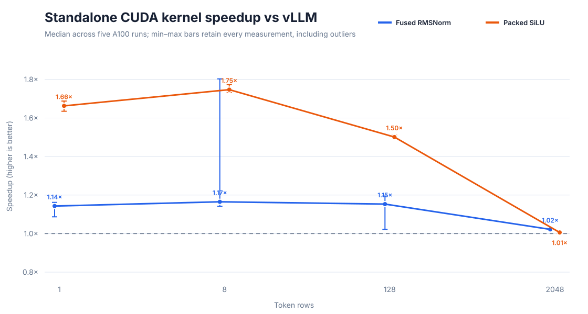
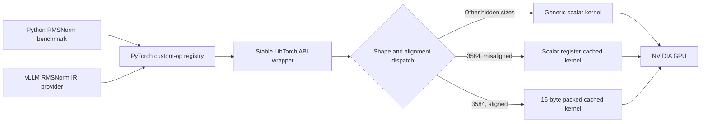
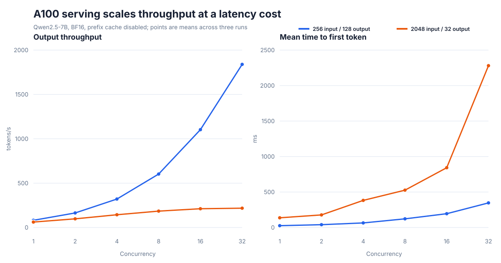

# Inference Performance Lab

[](https://github.com/sreeganeshji/inference-performance-lab/actions/workflows/quality.yml)


[](LICENSE)

An independent CUDA and inference performance project by [Ganesh Bangalore](https://github.com/sreeganeshji).
The main case study follows Qwen2.5-7B on an A100 from prefill/decode profiling through fused residual-add + RMSNorm
optimization, correctness testing, and integration into vLLM IR dispatch.

The engineering question: how much does a faster CUDA primitive improve model serving? The project measures both
standalone operation latency and serving behavior, with raw measurements and profiler summaries available for review.

## Results at a glance

Published serving measurements use Qwen2.5-7B-Instruct in BF16 on one NVIDIA A100-SXM4-40GB. Standalone benchmarks use
synthetic tensors at the model's hidden/intermediate dimensions. Their speedups below are medians across five runs;
the [generated summary](results/generated-summary.md) includes every run's observed range.

| Result | Measurement | Takeaway |
|---|---:|---|
| Fused residual-add + RMSNorm, 1 / 8 / 128 rows | **1.143x / 1.165x / 1.153x** vs vLLM | Packed transfers and register caching improve the measured standalone path. |
| Five leading BF16 GEMM variants, decode-heavy trace | **~89%** of GPU kernel time | The baseline is dominated by GEMMs; RMSNorm occupies ~1.6%. |
| Prefill-heavy serving, concurrency 16 → 32 | **+2.9%** throughput; **2.7x** mean TTFT | Higher concurrency adds substantial latency for little throughput gain. |
| Custom RMSNorm in a matched vLLM trace | **6,104 launches** | The custom provider executes inside vLLM's model-serving path. |
| End-to-end throughput with custom RMSNorm | **No material improvement** | Mixed changes of −0.42% to +0.04% across the measured configurations. |
| Additional experiment: packed SiLU, 8 / 128 rows | **1.747x / 1.501x** vs vLLM | Standalone results; this operation has not been integrated into the serving comparison. |

RMSNorm occupied 1.5% of aggregate GPU kernel time in the matched provider traces. The custom implementation consumed
2.72% more aggregate RMSNorm GPU time in that workload despite its standalone gains. Even if a 1.15x speedup had
transferred, Amdahl's law would bound the improvement in that GPU kernel-time component to about 0.2%; this is not a
prediction of wall-clock serving throughput. See the [matched-provider analysis](results/a100-qwen2.5-7b-custom-rmsnorm-analysis.md).



## From profiler trace to production path



The baseline trace showed that BF16 GEMMs occupied roughly 87–89% of aggregate GPU kernel time and were already using
optimized Ampere tensor-core implementations. Fused RMSNorm was chosen as a bounded, memory-oriented first kernel;
fused SiLU-and-multiply followed as a larger elementwise workload.

### Fused residual-add and RMSNorm

- One block per token row and 256 threads per block.
- FP32 accumulation with warp shuffles and a two-level block reduction.
- Fused residual update, RMS normalization, and BF16 output write.
- A hidden-size-3584 specialization caches fused values in registers.
- The packed path transfers eight BF16 values per 16-byte load or store.
- Contiguous, misaligned tensors at hidden size 3584 use the scalar cached kernel; other hidden sizes use the generic
  kernel. Noncontiguous tensors and unsupported dtypes are rejected.

The current tests compare both custom and vLLM implementations with a PyTorch reference at 1, 8, 128, and 2,048 rows.
Separate tests verify deliberately misaligned custom RMSNorm inputs against that reference.

### Additional experiment: fused SiLU-and-multiply

- Computes the SwiGLU elementwise stage without intermediate tensors.
- Provides scalar and packed BF16 implementations behind the same custom-op library.
- Uses a two-dimensional launch: rows on `blockIdx.y`, contiguous output columns across threads on `blockIdx.x`.
- The packed implementation reached a 1.774x best observed speedup at eight rows and a 1.501x median at 128 rows.
- The packed API requires 16-byte-aligned contiguous tensors and an output width divisible by eight; the scalar API
  is separately callable. Only RMSNorm currently has a custom vLLM IR provider.

## Serving behavior

The baseline sweep used 32 fixed-shape requests per run, three repetitions, burst arrival, deterministic generation,
and disabled prefix caching. Throughput increased with concurrency, but prefill-heavy latency rose sharply after the
throughput knee.



For the 2,048-input/32-output workload, output throughput increased only 2.93% from concurrency 16 to 32 while mean
time to first token grew from 843 ms to 2,281 ms. This makes concurrency 16 the approximate throughput knee for that
controlled workload.

The baseline above uses 32 requests per run. The custom-versus-vLLM RMSNorm comparison uses 64 requests per run,
concurrency 1 / 8 / 32, and three repetitions for each provider. Those experiments are reported separately.

The detailed interpretation, including the matched-provider comparison and limitations, is in the
[custom RMSNorm analysis](results/a100-qwen2.5-7b-custom-rmsnorm-analysis.md). The
[results index](results/README.md) connects every headline claim to summaries and raw artifacts.

## Reproduce locally

### Prerequisites

- Linux or WSL2 with an NVIDIA GPU visible through `nvidia-smi`
- CUDA 13 toolkit with `nvcc` and a compatible C++ compiler (the extension uses C++20)
- Python 3.12 and [uv](https://docs.astral.sh/uv/)
- An Ampere-or-newer GPU for the BF16 development path

The local development path was validated on an RTX 3080 Ti (SM 8.6, 12 GiB). Published portfolio measurements remain
the controlled A100 (SM 8.0, 40 GiB) results.

Install only the dependencies required to build and test the CUDA kernels:

```bash
git clone https://github.com/sreeganeshji/inference-performance-lab.git
cd inference-performance-lab
./scripts/bootstrap.sh --kernels-only
./scripts/doctor.sh
./scripts/test_kernels.sh
```

`test_kernels.sh` lets PyTorch detect the visible GPU. To build for a specific architecture, set it explicitly:

```bash
TORCH_CUDA_ARCH_LIST=8.6 ./scripts/test_kernels.sh
```

The first kernel call compiles the extension with Ninja and NVCC, then caches it under
`.cache/torch_extensions/fused_add_rms_norm/`.

Both profiles share `.venv`. Running `bootstrap.sh --kernels-only` removes the optional serving packages; running
`bootstrap.sh` reinstalls them from the lockfile. Use `uv run --locked --no-sync` for subsequent commands to preserve
the selected profile.

### Full vLLM environment

The default profile includes the optional serving stack:

```bash
./scripts/bootstrap.sh
./scripts/doctor.sh
uv run --locked --no-sync pytest -m "gpu"
```

Run the standalone comparisons:

```bash
uv run --locked --no-sync python benchmarks/benchmark_fused_add_rms_norm.py
uv run --locked --no-sync python benchmarks/benchmark_silu_and_mul.py
```

The serving commands reproduce the A100 experiment and download the pinned model revision. BF16 weights alone exceed
the 3080 Ti's 12 GiB, so use that GPU for kernel work and a GPU with sufficient memory for this serving experiment.
Start the baseline server in terminal 1:

```bash
./scripts/serve.sh
```

After the server is ready, run the baseline sweep in terminal 2:

```bash
./scripts/run_sweep.sh
```

To reproduce the matched-provider protocol, run this sweep against the baseline server:

```bash
NUM_PROMPTS=64 CONCURRENCIES="1 8 32" PROTOCOL=rmsnorm/vllm-c ./scripts/run_sweep.sh
```

Stop the baseline server with Ctrl+C, then start the custom RMSNorm provider in terminal 1:

```bash
FUSED_RMSNORM_PROVIDER=inference_lab ./scripts/serve.sh
```

After it is ready, run the same workload in terminal 2:

```bash
NUM_PROMPTS=64 CONCURRENCIES="1 8 32" PROTOCOL=rmsnorm/inference-lab ./scripts/run_sweep.sh
```

New runs are written under `artifacts/raw/<protocol>/`. The serving harness currently targets the fixed A100/Qwen
experiment and names files accordingly. Protocol directory separators become hyphens in filenames. To use a different
port, set the same `VLLM_PORT` value in both terminals. Historical A100 results predate the Stable ABI migration; a new run on the
current checkout is a fresh measurement, not a replacement for that evidence.

Regenerate the checked-in result summary and README charts with:

```bash
uv run --locked --no-sync python scripts/generate_readme_assets.py
```

This generator also runs without GPU dependencies: `python3 scripts/generate_readme_assets.py`.

## Repository guide

| Path | Purpose |
|---|---|
| `csrc/` | Stable-ABI PyTorch registration and CUDA kernel implementations |
| `src/inference_performance_lab/kernels/` | Python API, references, and vLLM provider integration |
| `tests/` | PyTorch-reference correctness, alignment fallbacks, and optional vLLM comparisons |
| `benchmarks/` | CUDA-event microbenchmarks against vLLM implementations |
| `scripts/` | Environment setup, serving, workload sweeps, profiling setup, and result generation |
| `results/` | Analysis, aggregate tables, raw benchmark data, and profiler evidence |

## Build and compatibility

The extension targets the PyTorch 2.13 Stable LibTorch ABI. Its host wrappers use `torch::stable::Tensor`, boxed
operator registration, header-only scalar types, stable device guards, and stable accelerator streams.
`TORCH_TARGET_VERSION=0x020d000000000000` is passed to both C++ and CUDA compilation so accidental use of newer ABI
surfaces fails during the build.

The CUDA kernels still operate on typed device pointers. Stable-ABI integration did not change their thread mapping,
memory access, reductions, launch dimensions, or numerical behavior.

The Quality workflow checks Python/C++ formatting, lint, each shell script's syntax, the lockfile, and generated
artifacts on a CPU runner. GPU correctness is checked separately with the commands above.

## Limitations and follow-up work

- Published performance measurements cover one A100, one model, BF16, and synthetic fixed-length requests.
- Five standalone repetitions and three serving repetitions characterize these workloads, not every deployment.
- The optimized RMSNorm specialization targets hidden size 3584; other shapes use a generic fallback.
- Provider runs were not interleaved, so temporal system effects may remain.
- Microbenchmarks enqueue operations from Python between CUDA events, reuse buffers, and run implementations in a
  fixed order. Small-shape timings can include dispatch gaps and cache effects; they are not isolated kernel timings
  or a statistical confidence interval. The RMSNorm timing loop repeatedly mutates its input buffers.
- A standalone CMake/raw-CUDA frontend would be useful for learning and profiler isolation, but the production path
  intentionally remains the PyTorch extension used by vLLM.
- The next system-level optimization should be selected from a fresh production trace rather than from isolated
  kernel speedup alone.

## License

Released under the [MIT License](LICENSE).
